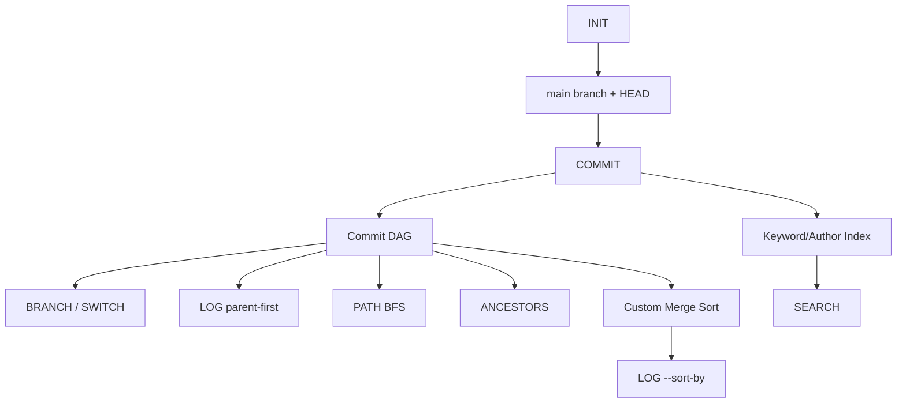

# B3-2 Round 01 — Beginner Guide

구분: **필수 미션 (REQUIRED)**  
현재 모드: **Phase A — REFERENCE BUILD**  
Runtime Mission 상태: **⬜ NOT STARTED**

> 이 문서는 Phase C에서 입문자가 실제로 한 단계씩 따라가기 위한 기준 경로입니다. 현재 Reference 코드와 검증 절차를 준비한 상태이며, 아래 Runtime 결과를 아직 PASS로 간주하지 않습니다.

## 00. 미션 한눈에 보기

Mini Git을 직접 만들면서 다음 구조를 배웁니다.

```text
Commit DAG
├── Branch pointer / HEAD
├── Parent-first LOG
├── BFS shortest PATH
├── ANCESTORS traversal
├── Inverted Index search
└── Custom stable merge sort
```

핵심 공식 요구는 `INIT`, `BRANCH`, `SWITCH`, `COMMIT`, `LOG`, `PATH`, `ANCESTORS`, `SEARCH`와 `LOG --sort-by=date|author`입니다. 파일 내용 추적·네트워크·영속 저장은 필수가 아닙니다.

## 01. 전체 개념도



쉽게 말하면 commit은 그래프의 점, parent는 점을 잇는 방향선, branch는 특정 commit을 가리키는 이름표입니다. 검색은 commit을 매번 전부 읽는 대신 미리 만든 색인에서 후보를 찾습니다.

---

# STEP 01 — 공식 요구와 Reference 구조 확인

① **왜 하는가**  
무엇을 구현해야 하는지 모른 채 실행하면 기능을 빠뜨리기 쉽습니다.

② **무엇을 하는가**  
공식 Mission/Evaluation과 Reference 파일 구조를 확인합니다.

③ **이번 단계 용어**  
- 방향성 비순환 그래프 (Directed Acyclic Graph, DAG): 방향은 있지만 순환이 없는 그래프
- 커밋 (Commit): 변경 이력의 한 지점
- 부모 커밋 (Parent Commit): 현재 commit이 이어지는 이전 commit

④ **핵심 개념**  
B3-2는 실제 Git 전체를 만드는 과제가 아니라 commit metadata와 graph algorithm을 학습하는 Mini Git입니다.

⑤ **명령어**

```bash
pwd
ls
find training/round-01-clear/reference -maxdepth 3 -type f | sort
```

⑥ **주석**  
`find`는 Reference 구현 파일이 준비되어 있는지 확인합니다. 실제 구현에서 Python `sorted()`를 사용하는 명령이 아닙니다.

⑦ **정상 결과**  
`main.py`, `mini_git/`, `tests/`가 보입니다.

⑧ **의미**  
실습할 기준 구현의 위치가 확정되었습니다.

⑨ **오류 해결**  
경로가 없다면 B3-2 저장소 루트인지 먼저 확인합니다.

⑩ **완료 확인**  
`[ ] Reference 파일 위치를 찾았다.`

---

# STEP 02 — Python 환경과 자동검증

① 왜 하는가  
공식 환경은 Python 3.10 이상이며 금지 API도 함께 확인해야 합니다.

② 무엇을 하는가  
Reference verify를 실행합니다.

③ 용어  
- 검증기 (Verifier): 요구사항을 자동 확인하는 도구
- 추상 구문 트리 (Abstract Syntax Tree, AST): Python 소스 구조를 분석한 트리

④ 핵심 개념  
`verify.sh`는 소스 파일, Python 문법, unit test, 금지된 정렬 API/graph library, command smoke test를 확인합니다.

⑤ 명령어

```bash
python3 --version
bash training/round-01-clear/environment/verify.sh
```

⑥ 주석  
Reference 단계의 검증이며 실제 REPL Evidence를 대체하지 않습니다.

⑦ 정상 결과  
마지막 줄이 `Result: N PASS / 0 FAIL`입니다.

⑧ 의미  
Reference 구현의 자동 검증 Gate가 통과한 것입니다.

⑨ 오류 해결  
Python 3.10 미만이면 환경을 먼저 교정합니다. Unit test 실패 시 출력된 test 이름부터 확인합니다.

⑩ 완료 확인  
`[ ] 실제 verify 결과를 저장했다.`

---

# STEP 03 — INIT / COMMIT / Branch pointer 이해

① 왜 하는가  
Mini Git의 가장 기본 상태인 repository, branch, HEAD, commit 관계를 확인합니다.

② 무엇을 하는가  
REPL을 시작하고 첫 commit과 branch를 만듭니다.

③ 용어  
- 브랜치 (Branch): commit hash를 가리키는 이름
- HEAD: 현재 작업 중인 branch를 가리키는 상태
- 포인터 (Pointer): 다른 대상을 가리키는 참조

④ 핵심 개념  
branch 생성은 commit을 복사하는 작업이 아닙니다. 현재 HEAD commit hash를 새 branch 이름에도 연결합니다.

⑤ 명령어

```bash
export PYTHONPATH="$PWD/training/round-01-clear/reference"
python3 training/round-01-clear/reference/main.py
```

REPL에서:

```text
INIT "Alice Kim"
COMMIT "Initial commit"
BRANCH feature
SWITCH feature
COMMIT "Add login feature"
```

⑥ 주석  
실제 생성되는 commit hash를 이후 명령에서 사용합니다. 문서의 예시 hash를 그대로 가정하지 않습니다.

⑦ 정상 결과  
초기화, branch 생성/전환, commit 생성과 hash가 출력됩니다.

⑧ 의미  
현재 branch pointer가 새 commit으로 이동했습니다.

⑨ 오류 해결  
`Repository not initialized`가 나오면 `INIT`을 먼저 실행합니다. `Unknown branch`면 branch 이름을 확인합니다.

⑩ 완료 확인  
`[ ] main/feature branch의 pointer 변화를 설명할 수 있다.`

---

# STEP 04 — LOG와 DAG 확인

① 왜 하는가  
공식 B3-2의 기본 LOG는 최신순이 아니라 **parent가 child보다 먼저** 나와야 합니다.

② 무엇을 하는가  
두 branch에 commit을 만든 뒤 LOG를 확인합니다.

③ 용어  
- 위상 정렬 (Topological Ordering): 선행 노드가 후행 노드보다 먼저 나오는 순서
- 깊이 우선 탐색 (Depth-First Search, DFS): 한 경로를 깊게 탐색하는 방식

④ 핵심 개념  
Reference는 commit을 출력하기 전에 부모를 먼저 방문하는 parent-first DFS를 사용합니다.

⑤ 명령어  
REPL에서 branch를 하나 더 만들고 commit한 뒤:

```text
LOG
```

⑥ 주석  
각 출력의 `parents=` 값을 보고 모든 parent hash가 child보다 위에 있는지 직접 확인합니다.

⑦ 정상 결과  
parent commit이 child commit보다 먼저 나타납니다.

⑧ 의미  
DAG 선후관계가 LOG에서 보존됩니다.

⑨ 오류 해결  
부모가 뒤에 나타난다면 `log_parent_first()`와 방문 순서를 점검합니다.

⑩ 완료 확인  
`[ ] parent-first 조건을 실제 출력으로 확인했다.`

---

# STEP 05 — 직접 구현 정렬 확인

① 왜 하는가  
공식 제약은 `sorted()`와 `list.sort()`를 금지합니다.

② 무엇을 하는가  
날짜/작성자 기준 LOG를 확인합니다.

③ 용어  
- 병합 정렬 (Merge Sort): 분할 후 정렬된 결과를 병합하는 O(n log n) 정렬
- 안정 정렬 (Stable Sort): 같은 key의 기존 상대 순서를 유지하는 정렬

④ 핵심 개념  
Reference는 직접 구현한 stable merge sort를 사용합니다.

⑤ 명령어

```text
LOG --sort-by=date
LOG --sort-by=author
```

⑥ 주석  
기본 LOG의 parent-first 규칙과 `--sort-by`의 정렬 규칙은 공식 미션에서 별도 기능입니다.

⑦ 정상 결과  
각 비교 기준에 맞는 순서로 출력됩니다.

⑧ 의미  
표준 정렬 API 없이 비교 key를 바꾸는 정렬을 구현한 것입니다.

⑨ 오류 해결  
`Invalid args`면 `--sort-by=date` 또는 `--sort-by=author` 표기를 확인합니다.

⑩ 완료 확인  
`[ ] 평균/최악 O(n log n), stable=yes를 설명할 수 있다.`

---

# STEP 06 — PATH 최단경로와 No path

① 왜 하는가  
서로 갈라진 branch 사이 최단 경로를 통해 BFS를 이해합니다.

② 무엇을 하는가  
실제 commit hash 두 개로 PATH를 실행합니다.

③ 용어  
- 너비 우선 탐색 (Breadth-First Search, BFS): 가까운 노드부터 탐색하는 방식
- 최단 경로 (Shortest Path): 간선 수가 가장 적은 경로

④ 핵심 개념  
PATH에서는 parent-child 연결을 **무방향**으로 봅니다. 여러 최단경로가 있으면 hash sequence가 사전순으로 가장 작은 경로를 선택합니다.

⑤ 명령어

```text
PATH <실제_hash_1> <실제_hash_2>
```

No path를 직접 만들려면 새 세션에서 첫 commit 전에 branch를 나눕니다.

```text
INIT alice
BRANCH other
COMMIT "main root"
SWITCH other
COMMIT "other root"
PATH c000001 c000002
```

⑥ 주석  
위 구조는 두 branch가 모두 `None`에서 독립 root commit을 만들어 연결되지 않은 graph가 됩니다.

⑦ 정상 결과  
연결 graph는 hash 경로, 분리 graph는 `No path`가 출력됩니다.

⑧ 의미  
BFS의 연결성/최단거리 개념을 확인한 것입니다.

⑨ 오류 해결  
`Unknown commit`이면 실제 생성 hash를 다시 확인합니다.

⑩ 완료 확인  
`[ ] PATH와 No path를 모두 확인했다.`

---

# STEP 07 — ANCESTORS 탐색

① 왜 하는가  
PATH와 달리 조상 탐색은 parent 방향만 따라가야 합니다.

② 무엇을 하는가  
자식 commit에서 모든 조상을 조회합니다.

③ 용어  
- 조상 (Ancestor): parent를 반복해서 따라가 도달할 수 있는 과거 commit

④ 핵심 개념  
같은 graph라도 문제에 따라 간선 방향 사용법이 달라집니다.

⑤ 명령어

```text
ANCESTORS <child_hash>
```

⑥ 주석  
자식이나 형제는 조상 목록에 포함되지 않아야 합니다.

⑦ 정상 결과  
도달 가능한 모든 parent 계열 hash가 중복 없이 나타납니다.

⑧ 의미  
parent-direction traversal이 동작합니다.

⑨ 오류 해결  
`Unknown commit`이면 hash를 확인합니다.

⑩ 완료 확인  
`[ ] PATH와 ANCESTORS의 방향 차이를 설명할 수 있다.`

---

# STEP 08 — Inverted Index 검색

① 왜 하는가  
검색할 때 매번 모든 commit message를 순회하지 않기 위해서입니다.

② 무엇을 하는가  
keyword와 author 검색을 실행합니다.

③ 용어  
- 역색인 (Inverted Index): 단어/작성자에서 해당 문서·commit 목록으로 가는 색인
- 정규화 (Normalization): 비교하기 쉽도록 lower-case 등 동일 형식으로 바꾸는 것

④ 핵심 개념  
commit 생성 시 message를 공백으로 split하고 lowercase token을 index에 등록합니다.

⑤ 명령어

```text
SEARCH login
SEARCH LOGIN
SEARCH --author="Alice Kim"
```

⑥ 주석  
keyword는 공식 최소 기준에 따라 부분 문자열이 아니라 split된 token의 정확한 일치입니다.

⑦ 정상 결과  
해당 keyword/author의 commit만 출력됩니다.

⑧ 의미  
검색 비용을 commit 전체 순회 대신 index lookup 중심으로 바꿨습니다.

⑨ 오류 해결  
검색 결과가 없으면 message token과 author 철자를 확인합니다.

⑩ 완료 확인  
`[ ] keyword/author index 갱신 시점을 설명할 수 있다.`

---

# STEP 09 — 오류 계약 확인

① 왜 하는가  
정상 기능만큼 잘못된 입력을 예측 가능하게 처리하는 것이 중요합니다.

② 무엇을 하는가  
대표 오류를 실행합니다.

③ 용어  
- 오류 계약 (Error Contract): 어떤 오류 상황에서 어떤 형태로 응답할지 정한 규칙

④ 핵심 개념  
공식 최소 오류는 `Invalid args`, `Unknown branch`, `Unknown commit` 등입니다.

⑤ 명령어

```text
COMMIT
SWITCH missing
PATH c999999 c000001
LOG --sort-by=message
SEARCH
HELLO
```

⑥ 주석  
오류가 Python traceback으로 노출되는 것이 아니라 CLI 수준 메시지로 정리되는지 확인합니다.

⑦ 정상 결과  
각 상황에 맞는 표준 오류가 출력됩니다.

⑧ 의미  
명령 parser와 repository error의 책임이 분리되어 있습니다.

⑨ 오류 해결  
예외 traceback이 나오면 `execute()`의 error handling 범위를 확인합니다.

⑩ 완료 확인  
`[ ] 대표 오류 시나리오를 기록했다.`

---

# STEP 10 — Evidence와 CLEAR Gate

① 왜 하는가  
코드 존재와 실제 미션 완료를 구분하기 위해서입니다.

② 무엇을 하는가  
실제 verify/REPL/설명 결과를 Evidence로 남깁니다.

③ 용어  
- 증빙 (Evidence): 요구사항을 실제로 수행했음을 보여주는 결과
- CLEAR Gate: 최종 통과 전에 확인하는 조건

④ 핵심 개념  
`Requirement → Implementation → Verification → Evidence` 순서로 연결합니다.

⑤ 명령어

```bash
mkdir -p training/round-01-clear/evidence/runtime
bash training/round-01-clear/environment/verify.sh | tee training/round-01-clear/evidence/runtime/verify.txt
```

REPL 수행 결과는 `repl.txt`, 설명형 평가 답변은 `evaluation.md`에 정리한 뒤:

```bash
bash training/round-01-clear/environment/verify.sh --runtime
```

⑥ 주석  
Evidence에는 비밀번호·Token·Private Key 등의 비밀정보를 넣지 않습니다. B3-2 자체는 Secret이 필요한 미션이 아닙니다.

⑦ 정상 결과  
Reference verify와 Runtime Evidence Gate가 모두 `0 FAIL`입니다.

⑧ 의미  
자동검증 + 실제 수행 + 설명형 평가 자료가 연결된 상태입니다.

⑨ 오류 해결  
`--runtime` 실패 시 누락된 Evidence 파일부터 채웁니다. 실제 실행 전에는 억지로 빈 파일을 만들지 않습니다.

⑩ 완료 확인

```text
[ ] 공식 Mission 누락 없음
[ ] 공식 Evaluation 누락 없음
[ ] verify 실제 0 FAIL
[ ] REPL 핵심 명령 실제 수행
[ ] parent-first LOG
[ ] PATH shortest + No path
[ ] ANCESTORS
[ ] SEARCH keyword/author
[ ] date/author custom sort
[ ] 오류 시나리오
[ ] Evaluation 자기 말 설명
[ ] Evidence 완료
[ ] ✅ B3-2 CLEAR
```

## 평가 준비 핵심

평가 전에 최소한 다음을 자기 말로 설명할 수 있어야 합니다.

- Git commit graph가 DAG인 이유
- branch와 HEAD가 pointer인 이유
- parent-first LOG 구현 원리
- BFS가 최단경로에 적합한 이유
- PATH에서 무방향 edge를 사용하는 이유
- merge sort의 평균/최악 복잡도와 안정성
- inverted index가 전체 순회보다 유리한 이유
- commit 수가 커질 때 `_neighbors()` child scan이 병목인 이유
- PATH를 parent 방향으로 제한할 때의 변화
- author 정렬에도 parent-before-child 제약이 추가될 경우의 해결 전략
- counter hash와 random hash의 테스트/재현성 차이
